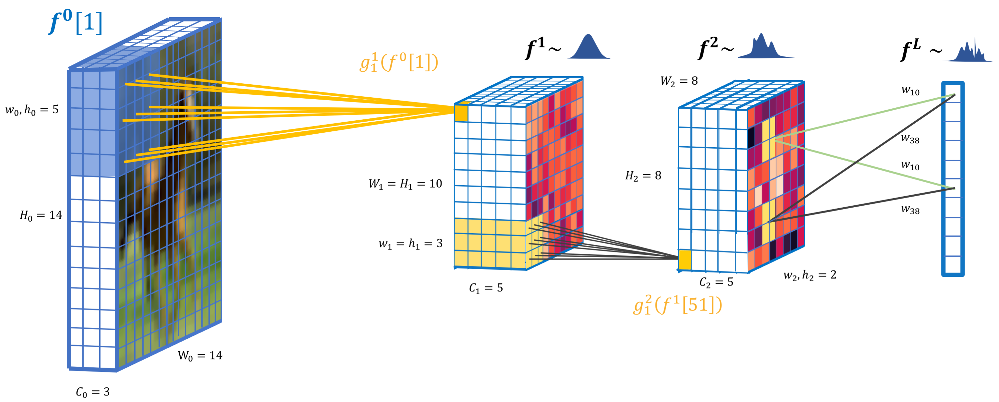

# Deep convolutional gaussian processes

This repository implements deep convolutional gaussian processes, a deep gaussian process model for hierarchically detecting combinations of local features in images.

Our method has been written about in our [paper](https://arxiv.org/abs/1810.03052). The figures in the paper have been generated using this [notebook](notebooks/Inspect.ipynb).

## Setup

This package uses the doubly stochastic deep gaussian process package. It has been included as a submodule to this repository. To install it run `sh ./init.sh`. This will initialize submodule and install the doubly stochastic deep gp package.

To install other dependencies run `pip install -r requirements.txt`.

## Running experiments

To run the mnist experiment run `python conv_gp/mnist.py`. Parameters and a number of options can be set using command line arguments. To see a full list of options run `python conv_gp/mnist.py --help`.

The CIFAR-10 experiment located at `conv_gp/cifar.py` works similarly.

